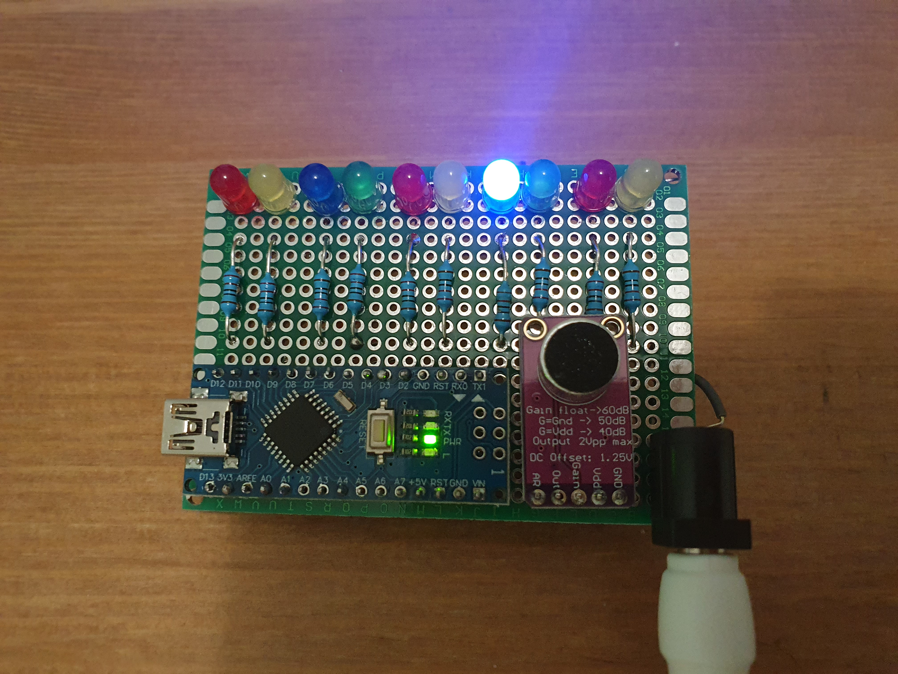
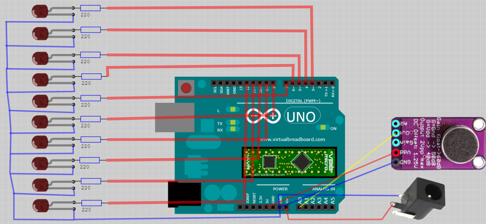

# Arduino FFT

Fast fourier transformation using Cooley–Tukey algorithm on Anrduino.
The project consists of a sound sensor and 10 LEDs which correspond to frequencies in range of 150Hz - 1500Hz.
The input sound is splited into frequencies and an LED that corresponds to the major frequincy within this range will light up.

### Equipment
* Arduino Nano Atmega328P - x1
* Max9814 Sound Sensor - x1
* Resistor 220 Ω - x11
* LED - x11
* Perfboard 7x5cm (24x18 holes + 2x8 side connectors) - x1
* Wires - x10
* 9V/1A DC Power supply (DC-005 male plug) - x1
* DC-005 feemale plug - x1
* Soldering set (iron, solder, flux, e.t.c.) - x1
* USB Cable - x1

⚠️⚠️⚠️ If you use a non-original Arduino Nano based on CH340/CH341 USB chip, you need to dowload drivers from http://www.wch.cn/download/CH341SER_EXE.html, otherwise Arduino studio does not recongnize the board.

### Circuit Diagram

### Tools
* Arduino Studio 1.8.12

### Optional
* Virtual Breadboard 1.5.0 - to open and modify the circuit diagram

### Flash
* Connect the microcontroller via USB
* Open src/arduino-fft/arduino-fft.ino in Arduino Studio
* Compile and flash the sketch
